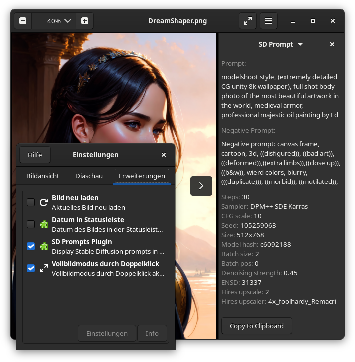

# EOG SD Prompts Plugin
A plugin to display Stable Diffusion prompts in EOG (Eye of Gnome) image viewer 



## Requirements
This plugin requires PyGObject and the [SD-Parsers](https://github.com/d3x-at/sd-parsers) Library. 

PyGObject should be available as system package on most distributions (e.g.: `python3-gobject` on Fedora Linux).

## Installation

Using pip (git needs to be installed), the installation can be done like this:

```
pip install --upgrade git+https://github.com/d3x-at/eog-sd-prompts-plugin
```

After installation, you will need to add a symbolic link to your user's EOG plugin directory.

Executing `python3 -m eog_sd_prompts_plugin install` will do exactly that for you if you feel lazy.

Alternatively, download this repository using your preferred method and put the `eog_sd_prompts_plugin` folder into `$XDG_DATA_HOME/eog/plugins/`.

In that case, you will need to install the SD-Parsers library separately using:
```
pip install sd-parsers
```

## Credits
Idea and motivation using AUTOMATIC1111's stable diffusion webui
- https://github.com/AUTOMATIC1111/stable-diffusion-webui
